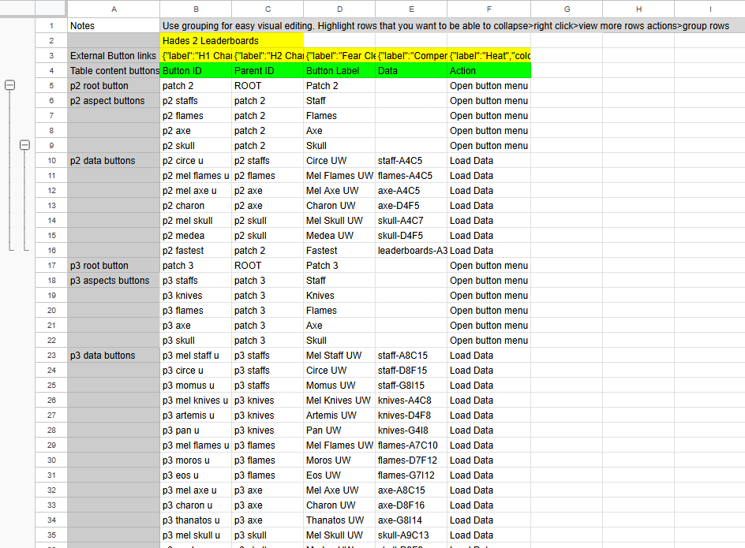

# Google Sheets Button Configuration Guide

## Create a Google Sheet

1. **Create a new Google Sheet.**

2. **Add a sheet with the name `buttonLayout`.**

   

## Button Layout Sheet Instructions

- **Notes:**  
  - Column A and Row 1 are reserved for taking notes.

- **External Links:**  
  - Row 2 (from Column B onwards) is where you place objects detailing what buttons you want for external links.  
  - Example object:
    ```json
    {"label":"H1 Chamber Guide","colour":"rgb(243, 42, 42)","link":"https://zacharywebsites.wixsite.com/chamber-guide-3"}
    ```
  - **Properties:**
    - **label:** The text that appears on the button.
    - **colour:** The color of the button. This can be an RGB value, a word, or a hex value (e.g., `#92ed91` for a light green).
    - **link:** The URL the button should link to.

- **Button Table Data (Starting at Row 3):**
  - **Headers:**
    - **Button ID:** A name used to refer to this button in the code.
    - **Parent ID:** If the button has a parent, this is the parent's button ID. If it does not have a parent, use `"ROOT"`.
    - **Button Label:** The text for the button.
    - **Data:** The data that will be linked in your spreadsheet. Use the syntax `{sheetName-range}`.
      - **Example:**  
        If you have data in a sheet called `fastest` and you want to show the runs in columns A2-C25, include the headers (A1-C1) and write the range with no "-" symbol: `"fastest-A1C25"`.  
        Make sure to use capital letters.
    - **Action:** The intended action for that button.
      - `"open a button menu"` opens up a new menu of all the child buttons.
      - `"load data"` adds the data into the table.

## Best Practices for Adding Buttons

- As long as you follow the correct headers, you can place the buttons in any order and the code will interpret them correctly.
- For easier editing and maintainability:
  - Start with root buttons, then add each layer successively below.
  - Then start at the next root button and repeat.
- **Adding a New Button:**  
  - To add a new button into a menu, select another button in the menu and right-click > **Add new row above/below**.  
    This maintains the layout, allowing you to add buttons to any branch of menus while still being able to see where everything is.

## Managing Rows with Google Sheets Grouping Function

- **To collapse rows together:**
  1. Highlight the rows you want to group.
  2. Right-click and select **View more row actions** > **Group rows**.
  3. A bar will appear on the left that you can use to collapse all the selected rows, making it easier to focus on the branch you are editing.

## Adding Data for the Buttons

- Create a new sheet, name it appropriately, and add the data with the correct headers.
- Use the syntax `{sheetName-range}` in your button configuration to reference this data so that the buttons load the correct information.

## Deploying the Google Sheets Extension Apps Script

1. **Locate the Code:**
   - The code for the extension is provided in a file called `googleSheetsExtension.md`.

2. **Add the Code:**
   - Open the `googleSheetsExtension.md` file.
   - Copy all the code from this file.

3. **Create a New Google Apps Script Project:**
   - Go to [Google Apps Script](https://script.google.com/).
   - Create a new project.
   - Paste the copied code into the script editor.

4. **Save and Deploy:**
   - Save the project.
   - Click on **Deploy** and select **New deployment**.
   - Choose **Web app** as the deployment type.
   - Configure the deployment settings. To work with this website script it will need to execute as your own account, and give access to anyone.
   - Deploy the project.
   - **Copy the URL** provided after deployment.

5. **Update Your Configuration:**
   - Open the `functions.js` file in your project.
   - In the config JSON object, replace the `baseURL` with the URL you copied from your deployed web app.
   - Save the changes in `functions.js`.

## Final Note

Following these steps will integrate your Google Sheets setup with the extension Apps Script, allowing dynamic button configurations and data loading via your deployed web app.
